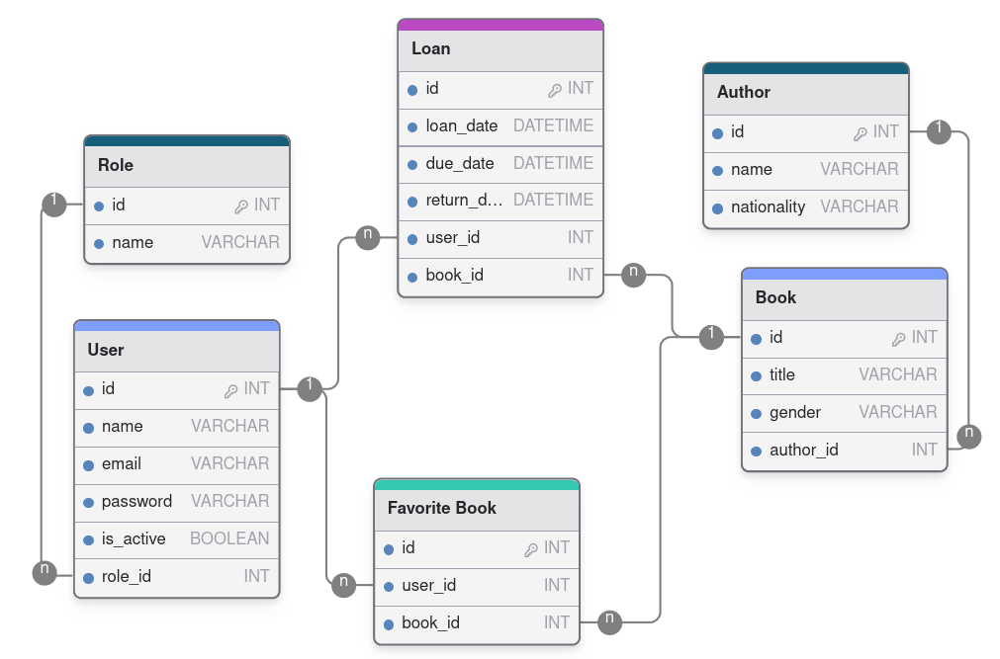

# API REST para Gestión de Préstamos de Libros en una Librería

## Descripción

El proyecto consiste en desarrollar una API RESTful para la gestión de préstamos de libros en una librería. La API permitirá a los usuarios realizar operaciones como crear, leer, actualizar y eliminar préstamos, gestionar usuarios, autores, libros y mantener una lista de libros favoritos para cada usuario.

## Características Principales

- Gestión de Usuarios
- Gestión de Autores y Libros
- Gestión de Préstamos
- Gestión de Libros Favoritos
- Visualización del Catálogo
- Edición de Perfil de Usuario
- Registro y Login de Usuarios

## Endpoints principales

### Users

| Método | URI                              | Acción                 | Rol            |
|--------|----------------------------------|------------------------|----------------|
| GET    | `/api/users/profile`             | Detalles del perfil    | user           |
| PUT    | `/api/users/profile`             | Actualiza perfil       | user           |
| GET    | `/api/users/favorite_books`      | Obtener mis favoritos  | user           |
| POST   | `/api/users/favorite_books`      | Agregar mi favorito    | user           |
| DELETE | `/api/users/favorite_books`      | Eliminar mi favorito   | user           |
| POST   | `/api/users`                     | Nuevo usuario          | admin          |
| GET    | `/api/users`                     | Lista de usuarios      | admin          |
| GET    | `/api/users/{id}`                | Detalles de usuario    | admin          |
| PUT    | `/api/users/{id}`                | Actualiza usuario      | admin          |
| DELETE | `/api/users/{id}`                | Elimina usuario        | admin          |
| PUT    | `/api/users/{id}/role`           | Cambiar rol            | admin          |

### Authors

| Método | URI                | Acción         | Rol   |
|--------|--------------------|----------------|-------|
| GET    | `/api/authors`     | Lista autores  | -     |
| POST   | `/api/authors`     | Nuevo autor    | admin |
| GET    | `/api/authors/{id}`| Detalles autor | -     |
| PUT    | `/api/authors/{id}`| Actualiza autor| admin |
| DELETE | `/api/authors/{id}`| Elimina autor  | admin |

### Books

| Método | URI                | Acción           | Rol   |
|--------|--------------------|------------------|-------|
| GET    | `/api/books`       | Lista libros     | -     |
| POST   | `/api/books`       | Nuevo libro      | admin |
| GET    | `/api/books/{id}`  | Detalles libro   | -     |
| PUT    | `/api/books/{id}`  | Actualiza libro  | admin |
| DELETE | `/api/books/{id}`  | Elimina libro    | admin |

### Loans

| Método | URI                      | Acción            | Rol            |
|--------|--------------------------|-------------------|----------------|
| GET    | `/api/loans`             | Lista préstamos   | admin, manager |
| GET    | `/api/loans/{id}`        | Detalles préstamo | admin, manager |
| GET    | `/api/loans/users/current`  | Préstamos del usuario autenticado  | user  |
| GET    | `/api/loans/users/{userId}`  | Préstamos por usuario  | admin, manager |
| POST   | `/api/loans`             | Nuevo préstamo    | admin, manager |
| PUT    | `/api/loans/{id}`        | Actualiza préstamo| admin, manager |   
| DELETE | `/api/loans/{id}`        | Elimina préstamo  | admin, manager |
| PUT | `/api/loans/return/{id}`        | Actualiza préstamo como devuelto  | admin, manager |

### Autenticación

| Método | URI                      | Acción                    |
|--------|--------------------------|---------------------------|
| POST   | `/api/auth/register`     | Registra un nuevo usuario |
| POST   | `/api/auth/login`        | Iniciar sesión.           |

## Tecnologías
- ORM: **Prisma**.
- Lenguaje:  **JavaScript**.

## Base de Datos Relacional

## Guía detallada
[Guía detallada](./setup-guide.md)